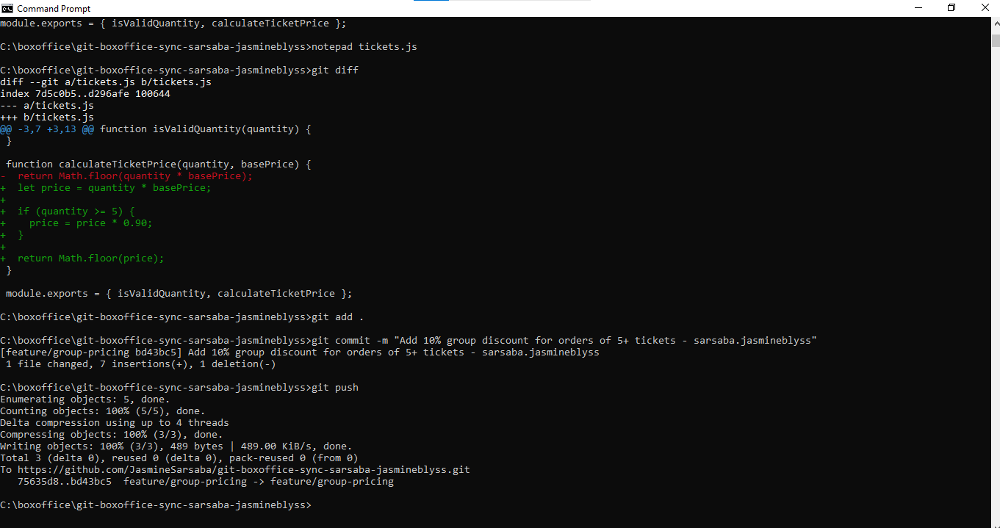
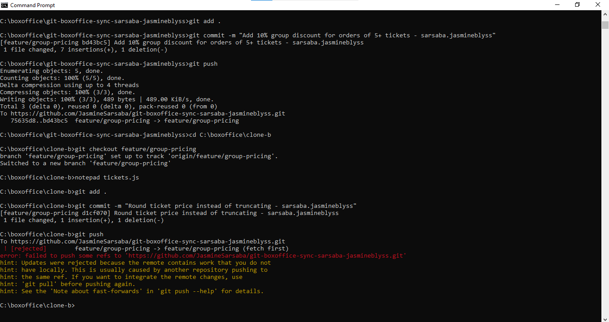
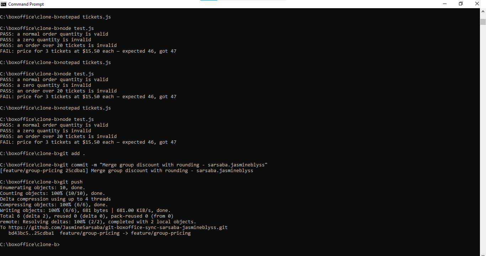
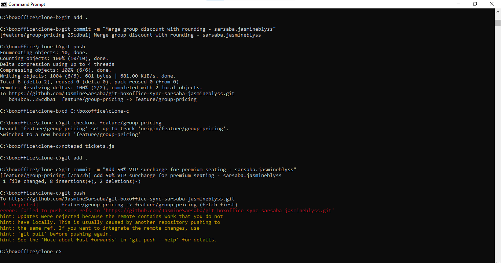
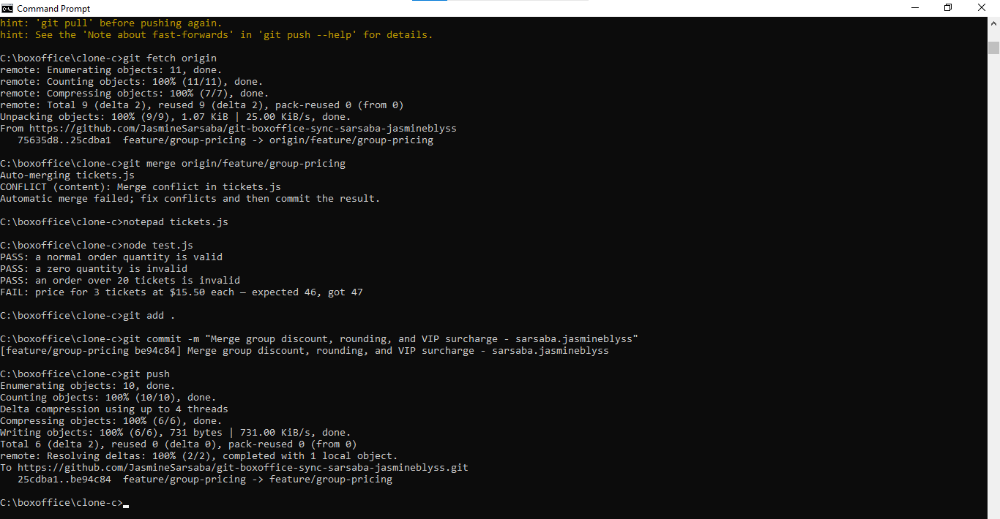
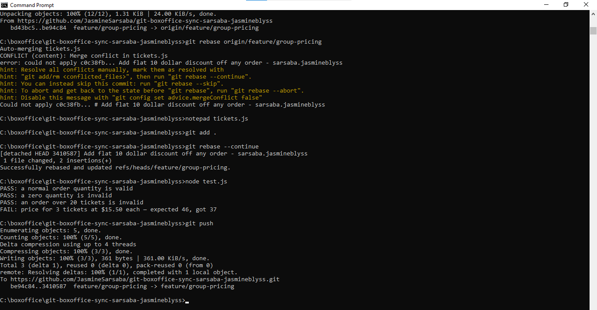
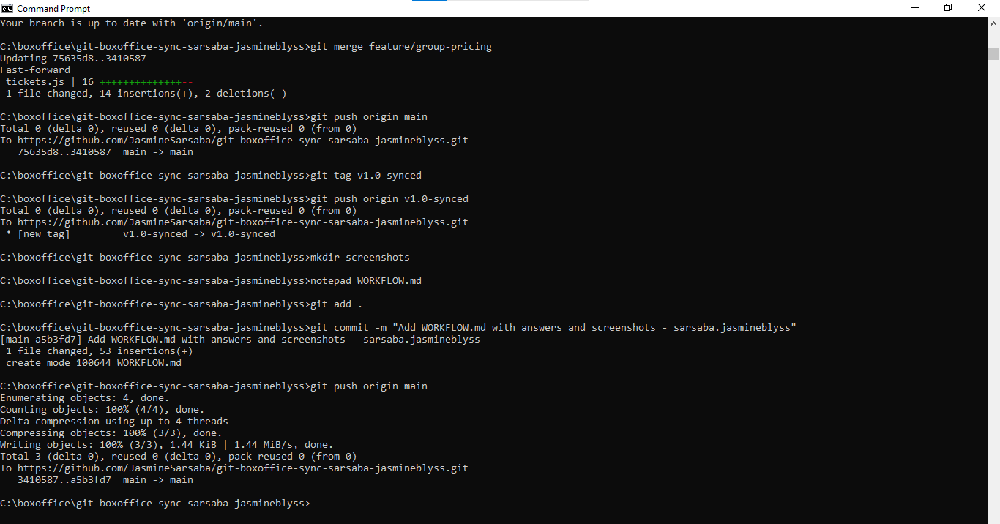

# Box Office Sync Workflow Documentation

## Question 1: Code Walkthrough

- **Base Rounding**: Added in Clone B during Task 2 (`tickets.js`) to round `quantity * basePrice` to whole numbers instead of truncating.

- **10% Group Discount**: Added in Clone A during Task 1 (`tickets.js`) to apply a `0.90` multiplier when `quantity >= 5`.

- **50% VIP Surcharge**: Added in Clone C during Task 4 (`tickets.js`) to apply a `1.50` multiplier when `isPremium` is true.

- **$10 Flat Discount**: Added in Clone A during Task 6 (`tickets.js`) to subtract `10` from the total ticket price before rounding.

## Question 2: Two-Way vs. Three-Way Conflicts

Task 3 was a two-way conflict between Clone A and Clone B, so we had to resolve the differences between the rounding and group discount changes. Task 5 was a three-way conflict because Clone C was merged on top of the already-merged changes from Clone A and Clone B. It was harder because we had to make sure all three business rules—rounding, group discount, and VIP surcharge—were still working correctly and in the right order. The function signature also changed because we needed to add isPremium, so we had to combine the changes carefully instead of just choosing one side.

## Question 3: Ripple Effect of Flat Discount

The flat $10 discount changed the overall calculation in calculateTicketPrice, which made the final totals lower in all test cases. Because the existing tests for the group discount and VIP surcharge were based on the old expected values, those tests failed even though their own logic was not changed. This shows that changing a shared function can affect other features that use it. Even if the change seems small or only affects one part of the code, it can still change the behavior of everything connected to that function.

## Question 4: Process Prevention

A strict branch integration and sync policy—such as requiring developers to run git pull --rebase origin feature/group-pricing before making changes, keeping feature branches short-lived, or using GitHub Pull Requests with continuous integration—would have prevented all three rejected pushes.

## Screenshot Evidence

### Task 1:

### Task 2:

### Task 3:

### Task 4:

### Task 5:

### Task 6:

### Task 7:

